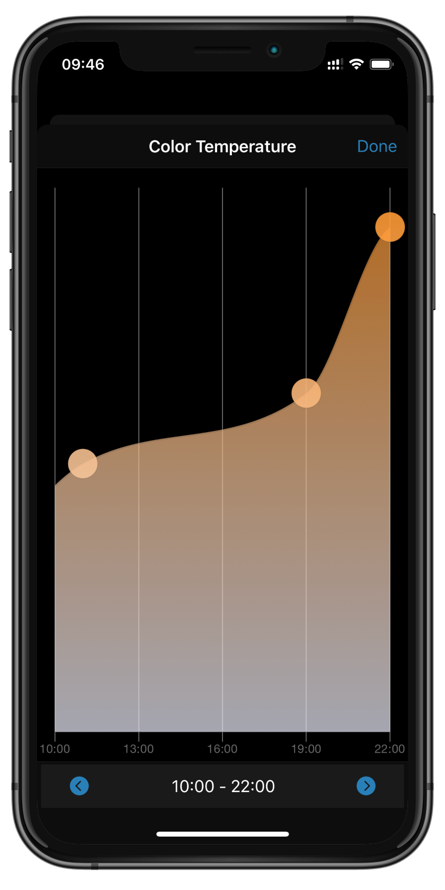
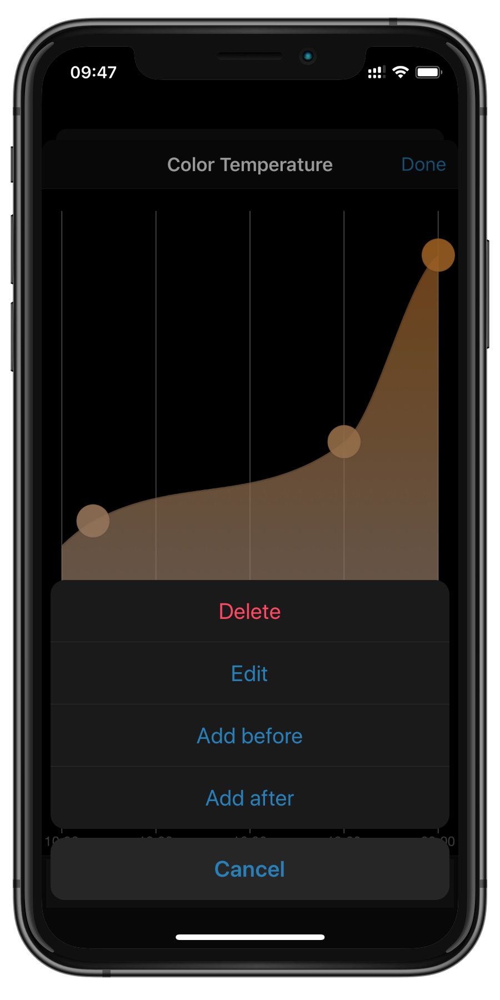
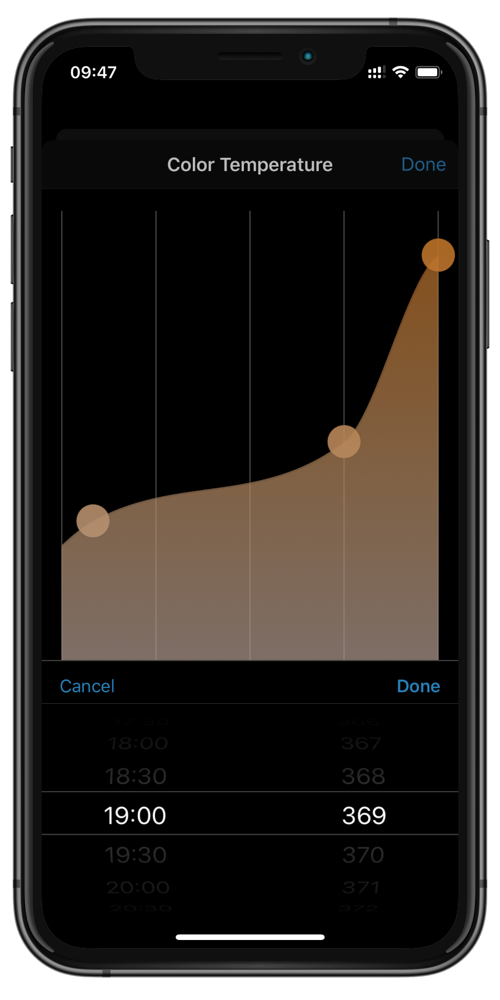

<p align="center">
    
</p>

<p align="center">
    <em>Makes your smart lights smart</em>
</p>

ambientHUE dynamically adjusts your Philips Hue smart lighting
(and any third party zigbee lights on your Hue bridge) based on your preferences
throughout the day.
Simply setup ambientHue as a homebridge plugin and enjoy the new smartness of your
lights.

ambientHue comes with a beautiful mobile first web application and an open API
with SwaggerUI documentation.
ambientHUE does not modify anything in your Hue bridge.

# Quickstart

To install Homebridge AmbientHue:

- Follow the instructions on the [Homebridge Wiki](https://github.com/homebridge/homebridge/wiki) to install Node.js and Homebridge.

- Install the Homebridge Hue plugin through Homebridge Config UI X or manually by:

```
$ sudo npm -g i homebridge-ambient-hue
```

- Configure the plugin in Homebridge's `config.json`.

| Key              | Default     | Description                                                                                                                                           |
| -----------------| ----------- | ----------------------------------------------------------------------------------------------------------------------------------------------------- |
| `platform`       |             | The name of the platform homebridge-ambient-hue provides to homebridge. Mandatory, must be set to `"AmbientHue"`.                                     |
| `bridgeIp`       |             | The IP address of your Hue bridge. Mandantory, if you do not know the ip, visit https://discovery.meethue.com/ in a Browser on your network.          |
| `user`           |             | The username for your Hue bridge. When connecting to a new bridge, homebridge-ambient-hue will create the username, and prompt to edit `config.json`. |
| `host`           | `"0.0.0.0"` | Hostname for the web interface.                                                                                                                       |
| `port`           | `3000`      | Port for the web interface.                                                                                                                           |
| `prefix`         | `""`        | A prefix that is attached to the name of all Devices.                                                                                                 |
| `suffix`         | `" Auto"`   | A suffix that is attached to the name of all Devices.                                                                                                 |
| `debugLog`       | `False`     | Output more detailed logs.                                                                                                                            |
| `enableSchedule` | `True`      | Enable scheduled updates.                                                                                                                             |

## First Steps

Select a light from the lights tab and enable ambientHUE:

- On/Off controlled: Switch on the light if the calculated brightess exceeds the On/Off threshold - and switch off the light if the light level falls below the threshold
- Brightness controlled: Dynamically adjust the brightness level according to the set curve. Define a maximum brightness in order to tune in with other lights controlled by ambientHue.
- Color Temperature controlled: Dynamically adjust the color temperature according to the set curve.

You can add the web application to your homescreen on iOS and Android devices and
install it as a Google Chrome App on your desktop.

# Features

ambientHue allows you to dynamically adjust the brightness and color temperature
of your lights and groups.

## Favorites

For quick access, you can add lights and groups to your favorites on the start page.
Press the edit button in the top right corner and select or deselect the items.

## Custom Curves

You can create custom curves and assign different lights and groups to each of them.
You can edit the curves by moving points via drag and drop. Create or
delete points by longpress, or right click on non touch devices

<p align="middle">
    
    
    
</p>

## Smart Off

Since ambientHUE runs periodically in the background, it would by default override any manual
changes to your controlled lights. To prevent this behaviour the "Smart Off" feature exists.

Before every run, ambientHUE will then check whether a light's state has changed since the previous
update. If that is the case, the light is considered to be user controlled and will not be overriden until the
light is put back to the previous state or until the next day.

## API Documentation

ambientHUE comes with a beautiful API documentation provided by fastapi. You can access the SwaggerUI at http://localhost:3000/api/swagger.

# Development

## Setup Development Environment

To develop Homebridge plugins you must have Node.js 12 or later installed, and a modern code editor such as [VS Code](https://code.visualstudio.com/). This plugin template uses [TypeScript](https://www.typescriptlang.org/) to make development easier and comes with pre-configured settings for [VS Code](https://code.visualstudio.com/) and ESLint. If you are using VS Code install these extensions:

- [ESLint](https://marketplace.visualstudio.com/items?itemName=dbaeumer.vscode-eslint)

## Install Development Dependencies

Using a terminal, navigate to the project folder and run this command to install the development dependencies:

```
npm install
npm install --prefix ui
```

## Build Plugin

TypeScript needs to be compiled into JavaScript before it can run. The following command will compile the contents of your [`src`](./src) directory and put the resulting code into the `dist` folder.

```
npm run build
```

## Link To Homebridge

Run this command so your global install of Homebridge can discover the plugin in your development environment:

```
npm link
```

You can now start Homebridge, use the `-D` flag so you can see debug log messages in your plugin:

```
homebridge -D
```

## Watch For Changes and Build Automatically

If you want to have your code compile automatically as you make changes, and restart Homebridge automatically between changes you can run:

```
npm run watch
```

This will launch an instance of Homebridge in debug mode which will restart every time you make a change to the source code. It will load the config stored in the default location under `~/.homebridge`. You may need to stop other running instances of Homebridge while using this command to prevent conflicts. You can adjust the Homebridge startup command in the [`nodemon.json`](./nodemon.json) file.

## Versioning

Given a version number `MAJOR`.`MINOR`.`PATCH`, such as `1.4.3`, increment the:

1. **MAJOR** version when you make breaking changes to your plugin,
2. **MINOR** version when you add functionality in a backwards compatible manner, and
3. **PATCH** version when you make backwards compatible bug fixes.

You can use the `npm version` command to help you with this:

```bash
# major update / breaking changes
npm version major

# minor update / new features
npm version update

# patch / bugfixes
npm version patch
```

## Publish Package

When you are ready to publish your plugin to [npm](https://www.npmjs.com/), make sure you have removed the `private` attribute from the [`package.json`](./package.json) file then run:

```
npm publish
```

If you are publishing a scoped plugin, i.e. `@username/homebridge-xxx` you will need to add `--access=public` to command the first time you publish.

#### Publishing Beta Versions

You can publish _beta_ versions of your plugin for other users to test before you release it to everyone.

```bash
# create a new pre-release version (eg. 2.1.0-beta.1)
npm version prepatch --preid beta

# publsh to @beta
npm publish --tag=beta
```

Users can then install the _beta_ version by appending `@beta` to the install command, for example:

```
sudo npm install -g homebridge-example-plugin@beta
```
